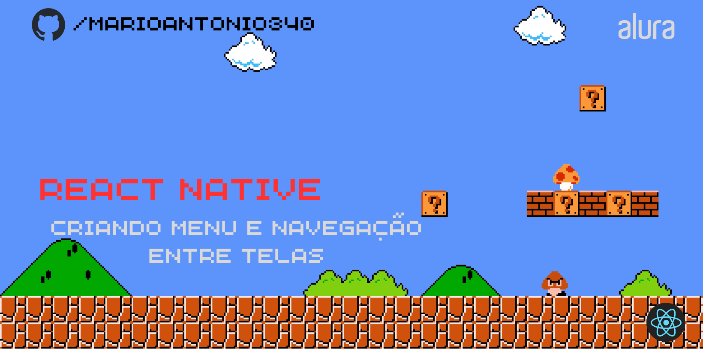

<!-- PROJECT LOGO -->
 

  

    
  

# Lista de Produtores na Home do Orgs

Projeto do curso de React Native: Utilizando e criando Hooks na Alura.

## 🔨 Funcionalidades do projeto

Neste projeto iremos fazer a tela Home do e-commerce de produtos naturais Orgs. Nessa tela listaremos os produtores de forma estática.

## ✔️ Técnicas e tecnologias utilizadas

- `Utilizar React Native CLI`
- `Utilizar Emulador Android`
- `Class Component`: Entender que existe outra forma de declarar componentes
- `Ciclos de Vida`: Identificar quando a tela foi carregada
- `Estados`: Salvar informações voláteis no aplicativo
- `Hooks`: Utilizando ciclo de vida e estados em componentes de função
  - Hooks de React Native
  - Hooks Customizados

## 🛠️ Abrir e rodar o projeto

Para instalar o React Native e o ambiente nativo na sua máquina siga os passos do [artigo de configuração de ambiente](https://www.alura.com.br/artigos/configurando-o-ambiente-react-native).