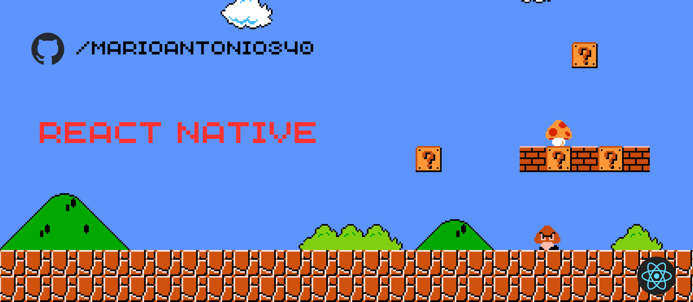

<!-- PROJECT LOGO -->
 

  

  
  

  
  <h3 align="center">React Native projects</h3>
    

    A repository with projects that I created for didactic purposes.
  

  

## Projects

- [Alura: Utilizando e criando hooks](https://github.com/Marioantonio340/react-native-projects/tree/alura-react-native-criando-e-utilizando-hooks)
